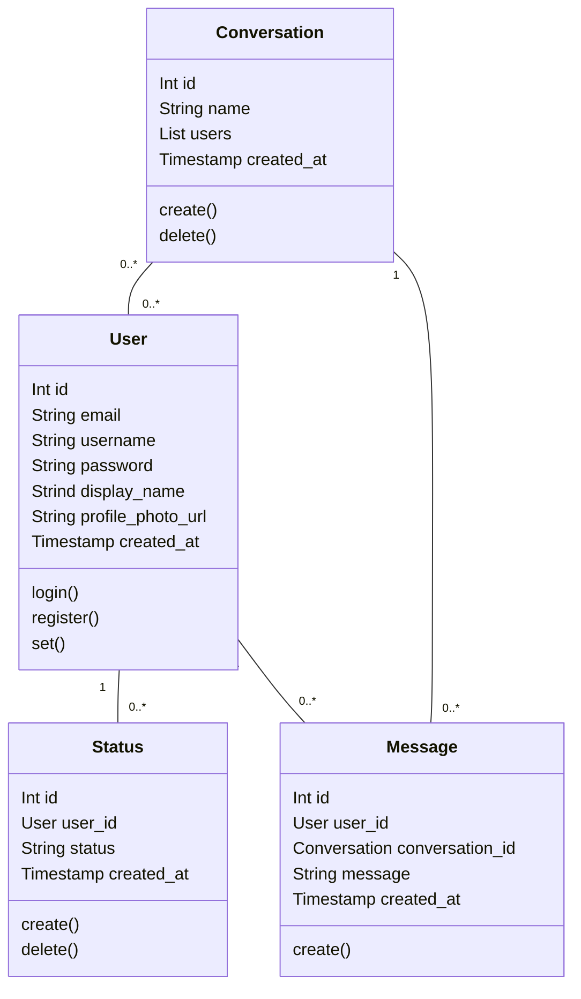

# mtaa

```mermaid
classDiagram
    class User {
        Int id
        String email
        String username
        String password
        Strind display_name
        String profile_photo_url
        Timestamp created_at
        login()
        register()
        set()
    }
    class Status {
        Int id
        User user_id
        String status
        Timestamp created_at
        create()
        delete()
    }
    class Conversation {
        Int id
        String name
        List<User> users
        Timestamp created_at
        create()
        delete()
    }
    class Message {
        Int id
        User user_id
        Conversation conversation_id
        String message
        Timestamp created_at
        create()
    }

    User "1" -- "0..*" Status
    Conversation "0..*" -- "0..*" User
    User "1" -- "0..*" Message
    Conversation "1" -- "0..*" Message
```