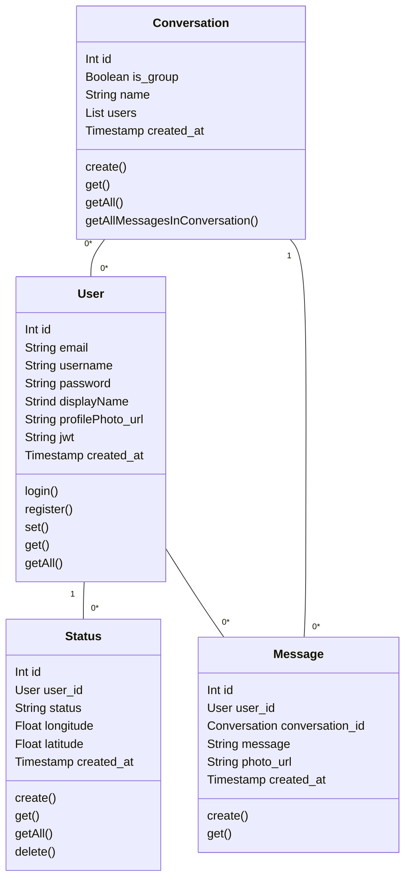

\pagebreak
# **Job Information**

|                |                                                            |
| -------------- | ---------------------------------------------------------- |
| **Name**       | Messenger app COMLY                                        |
| **Task**       | Docs                                                       |
| **Team**       | Patrik Fejda, Matej Pavlík                                 |
| **University** | Slovak Technical University in Bratislava                  |
| **Faculty**    | Faculty of Informatics and Information Technologies        |
| **Subject**    | MTAA_B - Mobile technologies and applications              |
| **Year**       | 2022/2023 Summer semester                                  |
| **Exercising** | Ing. Marek Galinski, PhD.                                  |
| **Lecturer**   | prof. Ing. Ivan Kotuliak, PhD. , Ing. Marek Galinski, PhD. |
| **Group**      | Tuesday 11:00                                              |

\pagebreak

## Introduction

We are building a native mobile app for Android - a messaging app that will allow users to communicate with each other.

The app will allow the users to communicate in one-2-one chats and group chats and to share their current status with other users.

## Wireframes

Figma project can be found [here](https://www.figma.com/proto/ROXp0vs8txJrxb912lWvNa/MTAA-APP?node-id=0%3A1)

### Project objectives

The main objective of the project is to build a modern messaging app, that will fulfill the social needs of the nowadays users.

The app is reflecting the social need for being more "real" by sharing the current status and location with other users.
Status will allow users to share their current mood, activity or something new in a gentle way - with no feel of flaunting or bragging. 

One of other advantages of the app will be that no "friending" will be required - the users will be able to communicate with each other without any prior communication.

## Features

### One-2-One Chats

The app will allow users to communicate with each other in one-2-one chats.
They will be able to send message to every user in the app.
User will be able to see the list of all the users in the app and start a chat with any of them.
In additional, they can send photos taken by the in-app camera.

### Group Chats

Same as one-2-one chats, but with multiple users.
The users will be able to create a group chat with other users.
Every group chat will have a name, which will be set by the user who created the group and can be changed by any user in the group.

### Video calls

The app will allow users to make video calls to each other. 
Video calls will be possible both in one-2-one chats and in group chats.
The videocalls will have a slack's huddle-like style - the user will not get any bothering notifications about the call, but will be able to join the call at any time clicking the "Join call" button.

### User status

The app will allow users to set their status. The status will be visible to all the users in the app.

Status is meant to be a simple quote or a short message about their current mood or activity and their current location.
Sharing status without sharing the location will not be possible.

### User profile

User can set their display name and profile picture. The profile picture will be visible to all the users in the app.
The display name will be default to the username, but can be changed by the user.

## Technical specification

### Backend

The backend will contain the following services:

- postgresql database
- python API app
  
Services will be deployed on a single server using Docker.

Python API app will be built using FastAPI framework.
FastAPI is a modern, fast (high-performance), web framework for building APIs with Python 3.6+ based on standard Python type hints.
For connecting to the database, we will use SQLAlchemy ORM.
Sending messages will be done using websockets.
Storing binary files (images) will be done using filestorage.

### Deployment

The app (consisting of postgresql database and python API app) will be deployed on a single server using Docker.

Docker image is provided in the repo.

Docker will be use both for development and production environments,
which will provide consistency between environments and will allow for easy deployment.

Local development environment will be deployed using docker-compose.
The production environment will be deployed on a cloud server.

### Frontend 

The app will be build for Android using React Native.

The frontend will be using the following tech stack:

- React Native
- TypeScript
- NativeBase for UI components
- Redux for state management
- Immer for handling immutable data (via Redux Toolkit)
- React Navigation for navigating between screens

### System APIs

The app will allow users to use the camera for taking photos and videos and for making video calls.
Also, the app will use the location services for sharing their location in status.

For that purpose, the app will use the following system APIs:

- Camera and microphone
- GPS location

## Users

App will have only type of users - regular users.
A regular user will be able to self-register in the app and use the app to communicate with other users.

In the app, no need for administrators will be required.

## UAT Tests

### Test 1: Send message to new user

**Description:** User sends a message to a user, with whom he has not had any previous communication.

**Preconditions:** User is logged in, user has a stable internet connection.

**Postconditions:** Message is sent to the user, user receives the message.

**Steps:**

1. User clicks on the "New message" button in the conversation list menu.
2. System displays a list of all users.
3. User selects a user, with whom he wants to communicate.
4. System shows a chat screen with selected user.
5. User types a message and clicks on the "Send" button.
6. System sends the message to the user.

### Test 1.1: Send message to old user (Alternative flow)

**Description:** User sends a message to a user, with whom he has had previous communication.

**Preconditions:** User is logged in, user has a stable internet connection.

**Postconditions:** Message is sent to the user, user receives the message.

**Steps:**

1. User selects a conversation with user, with whom he wants to communicate.
2. Continue with step 4 from Test 1.

### Test 2: Create group

**Description:** User creates a chat group with other users.

**Preconditions:** User is logged in, user has a stable internet connection.

**Postconditions:** Group is created, selected users are added to the group.

**Steps:**

1. User clicks on the "New message" button in the conversation list menu.
2. System displays a list of all users.
3. User clicks on the "Create group" button.
4. System displays a list of all users with checkboxes, input group name field and a "Create" button.
5. User sets the group name and selects users, with whom he wants to create a group and clicks on the "Create" button.
6. System creates a group, adds selected users to the group and displays the group chat.

### Test 3: Send message to group

**Description:** User sends a message to a group.

**Preconditions:** User is logged in, user has a stable internet connection, user is in a group (see Test 2).

**Postconditions:** Message is sent to the group, all users in the group receive the message.

**Steps:**

1. User selects a group conversation.
2. System shows a chat screen with selected group.
3. User types a message and clicks on the "Send" button.
4. Message is sent to the group.

### Test 4: Set status

**Description:** User sets their status.

**Preconditions:** User is logged in, user has a stable internet connection and GPS is enabled.

**Postconditions:** User's status is set with GPS information.

**Steps:**

1. User clicks on the "Status" button in the conversation list menu.
2. System displays a status screen with a text input field and a "Set" button.
3. User types a status and clicks on the "Set" button.
4. System fetched the GPS info from the device and sets the status with GPS info.

### Test 5: Send photo

**Description:** User sends a photo to another user.

**Preconditions:** User is logged in, user has a stable internet connection, app has working access to camera.

**Postconditions:** Photo is sent to the user.

**Steps:**

1. User selects a conversation with user, with whom he wants to communicate.
2. System shows a chat screen with selected user.
3. User clicks on the "Photo" button.
4. Sytem opens the camera interface.
5. User takes a photo and clicks on the "Send" button.
6. System sends the photo to the user.

### Test 6: Set profile photo

**Description:** User sets their profile photo.

**Preconditions:** User is logged in, user has a stable internet connection and app has working access to gallery.

**Postconditions:** User's profile photo and display name are set.

**Steps:**

1. User clicks on the "Settings" button in the conversation list menu.
2. System displays a settings screen with a "Change photo" button, a "Change display name" box.
3. User clicks on the "Change photo" button.
4. System opens the gallery interface.
5. User selects a photo and clicks on the "Set" button.
6. Profile photo is set.

### Test 6.1: Change display name (Alternative flow)

**Description:** User changes their display name.

**Preconditions:** User is logged in, user has a stable internet connection.

**Postconditions:** User's display name is changed.

**Steps:**

1. Follow steps 1-2 from Test 7.
2. User types a new display name and clicks on the "Set" button.
3. System changes the display name.

### Test 7: Send message with no internet connection

**Description:** User sends a message to another user with no internet connection.

**Preconditions:** User is logged in, user has no internet connection.

**Postconditions:** Message is saved as an unsent message (will sent when the internet connection is restored).

**Steps:**

1. User selects a conversation with user, with whom he wants to communicate.
2. System shows a chat screen with selected user.
3. User types a message and clicks on the "Send" button.
4. Message is saved as an unsent message.
5. User enables access to the internet.
6. System connectes to the server.
7. User clicks on the unsent message.
8. Message is sent to the user.

### Test 8: Save draft message

**Description:** User saves a draft message.

**Preconditions:** User is logged in, user has a stable internet connection.

**Postconditions:** Message is saved as a draft message.

**Steps:**

1. User selects a conversation with user, with whom he wants to communicate.
2. System shows a chat screen with selected user.
3. User types a message and clicks on the "Back" button.
4. System shows list of conversations screen.
5. User open the previous conversation.
6. System shows a chat screen with selected user and the draft message.
7. User click on the "Send" button.
8. Message is sent to the user.

### Test 9: Weak password

**Description:** User tries to register with a weak password.

**Preconditions:** User is not logged in, user has a stable internet connection.

**Postconditions:** User is not registered.

**Steps:**

1. User clicks on the "Register" button in the login screen.
2. System displays a registration screen with a form and a "Register" button.
3. User types valid email, display name and a weak password, clicks on the "Register" button.
4. System displays an error message.  

### Test 9.1: Email already exists (Alternative flow)

**Description:** User tries to register with an email that already exists.

**Preconditions:** User is not logged in, user has a stable internet connection.

**Postconditions:** User is not registered.

**Steps:**

1. Follow steps 1-2 from Test 10.
2. User types valid email of user that already exists, display name and a strong password, clicks on the "Register" button.
3. System displays an error message.

### Test 10: Not appropriate language in status

**Description:** User tries to set a status with not appropriate language.

**Preconditions:** User is logged in, user has a stable internet connection and GPS is enabled.

**Postconditions:** User's status is not set.

**Steps:**

1. User clicks on the "Status" button in the conversation list menu.
2. System displays a status screen with a text input field and a "Set" button.
3. User types a status with not appropriate language and clicks on the "Set" button.
4. System displays an error message.

### Test 11: GPS not available

**Description:** User tries to set a status with GPS not available.

**Preconditions:** User is logged in, user has a stable internet connection and GPS is not available.

**Postconditions:** User's status is not set.

**Steps:**

1. User clicks on the "Status" button in the conversation list menu.
2. System displays a status screen with a text input field and a "Set" button.
3. User types a status and clicks on the "Set" button.
4. System displays an error message.

## API endpoints

See [swagger](https://patrikfejda.github.io/mtaa-be/).

## Data model

[](https://mermaid.live/edit#pako:eNq1VNuK2zAQ_RWhp7Zkg5ykvlEK210KC81T2pdiMIM161VXlowkd5uG_HtlO8VObEJLqV48OnORztF4DrTQHGlKCwnW3gsoDVSZIn51CPli0ZBDj7TrQTki-LDfOSNUSbACISdo45MVVDhx1L70izaXdTjhwtYS9vl8ltGPQmJeP2mn88ZMD_z24gbss6jQOqhqUhgEhzyHkVfqUqhXrwfAYCmsQzPGLLrxtpxsb6X8jRzHsu0cuMZeE64TthUon5HTdukD_FFqcP7KqhSu4ThxgLvAr3PvsT9m1i6OEoeUM653Wn1HY_0dtLrG-IPWEkERYfPS6KaesD5_9E_-Nd61Kr3vZLL_kVyPbNFaKNE-qDGjWcqn0L9_3zOtitFmrguq_pTpfzDt_3-QxBPrje7GGQ0ySm5uvMHeeGs36sSzy5_8Q2SbfqXQdkzmotJsJF3QCo2fK9yPp07ojLon9C1CU29yMM8ZzdTRx0Hj9G6vCpo60-CCNjX3fE_TjKaPIK1Ha1A0PdAfNA2i9ZJtklUcvU3CdcTC1YLuPcw2y2gdrFcsjlcJS-LouKA_tfYl2DJi0SZmIUs2QZiEQdTV-9o5-0ORC6fN9jRO28_xFz4hkkk)