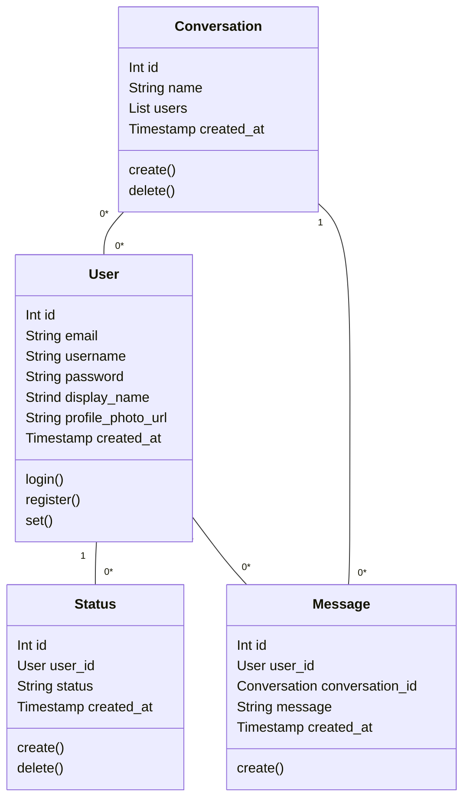

# MTAA APP DOCS

Figma project can be found [here](https://www.figma.com/file/ROXp0vs8txJrxb912lWvNa/MTAA-APP?node-id=0%3A1&t=vOF8JKwrQrwcdOob-0)

## 1. Introduction

We are building a native mobile app for Android - a messaging app that will allow users to communicate with each other.The app will allow the users to communicate in one-2-one chats and group chats.

## 2. Features

### 2.1. Video calls

The app will allow users to make video calls to each other. 

### 2.2. User status

The app will allow users to set their status. The status will be visible to all the users in the app.

Status is meant to be a simple quote or a short message about their current mood or activity.

### 2.3. User profile

User can set their display name and profile picture. The profile picture will be visible to all the users in the app.

## Data model

